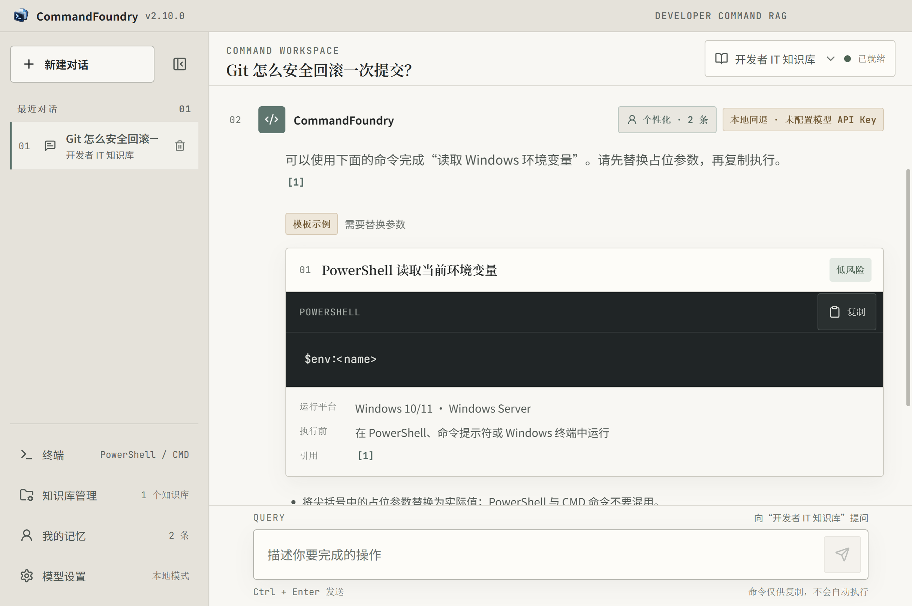
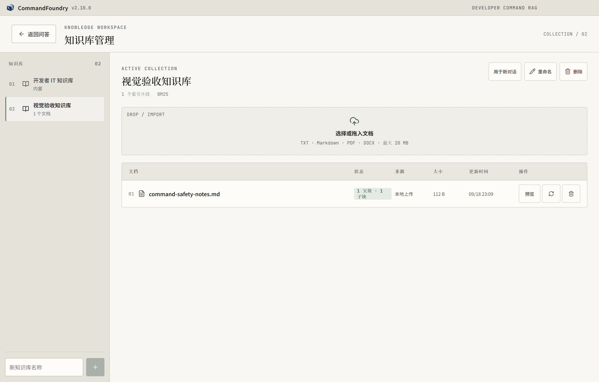
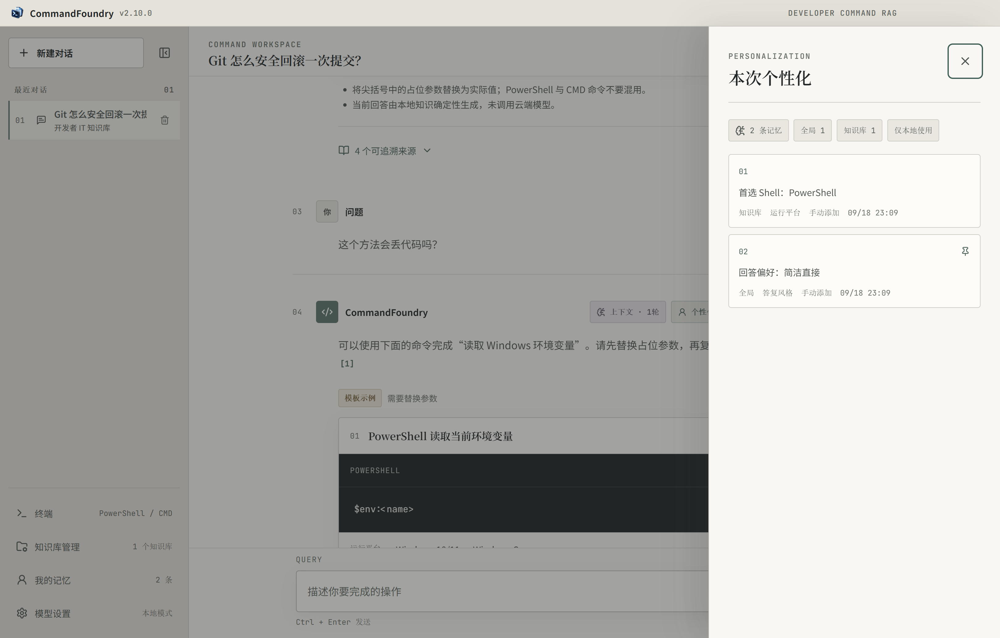

# CommandFoundry

CommandFoundry is a local-first command RAG desktop application for developers, currently focused on Windows.

## What it does

- Turns natural-language operations into source-grounded, copyable commands; asks for required details such as paths, shells, and ports when they are missing.
- Searches local knowledge with parent/child chunk retrieval and precise citations. It supports TXT, Markdown, PDF, and DOCX uploads, as well as multiple knowledge bases.
- Covers common PowerShell, CMD, and POSIX developer operations, including Python, Git, Docker, and Windows file, process, service, and networking topics.
- Uses the official OpenAI SDKs to connect to DeepSeek, OpenAI, Qwen, Moonshot, SiliconFlow, Ollama, and other OpenAI-compatible APIs.
- Provides local retrieval, personalized context, resumable command-parameter planning, and a side terminal. Local commands are run only after explicit user confirmation.

## Technology stack

| Layer | Technology |
| --- | --- |
| Desktop | Electron, electron-builder / NSIS, Node.js |
| Frontend | React, Vite, Lucide React |
| Backend | Python, FastAPI, Pydantic, SQLite, SSE |
| Retrieval | BM25, FastEmbed, ONNX Runtime, RRF |
| Model APIs | Official OpenAI Python/Node SDKs, OpenAI-compatible APIs |
| Packaging | PyInstaller, Windows x64 NSIS |

## Screenshots

### Command workspace

### Knowledge-base management

### Personalized context

中文版本：[README.md](README.md)
