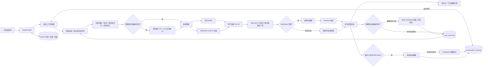

# 架构与关键取舍

## 核心链路



## 目录职责

```text
backend/app/
  knowledge.py    加载 topics.json 与 manifest 追溯校验
  retrieval.py    子块 BM25/FastEmbed/RRF、父块聚合与文档配额
  generation.py   DeepSeek OpenAI-compatible 调用与 JSON 校验
  memory.py       上下文预算、指代改写、双查询融合与后台摘要
  personalization.py  个性化信号门、脱敏、选择、衰减与后台提取
  answering.py    模型/本地回答路由与引用装配
  risk.py         与模型无关的确定性风险规则
  extraction.py   四种格式的结构化提取与页/行/段落/字符定位
  chunking.py     章节父块、检索子块、稳定 ID 与命令证据
  text.py         历史单层切分兼容入口
  documents.py    上传、可恢复后台索引和事务式版本切换
  repository.py   SQLite 会话记忆、用户记忆、知识库、文档与分块仓储
  main.py         多知识库 API 与 SSE 事件契约
frontend/src/     问答工作台与知识库管理页
desktop/electron/ 进程、协议、窗口和 safeStorage 边界
knowledge/        300 个结构化主题、来源锁、评测集和声明
```

## 为什么这样设计

### 小数据直接内存检索

内置知识库只有 300 个主题，自定义库也定位于个人文档规模。引入 Milvus、FAISS、Chroma 或 PostgreSQL 会增加部署和打包成本。每个知识库按需加载 BM25 与归一化向量矩阵，文档变更后原子替换缓存。

### BM25 与向量互补

命令问题常含精确 token，例如 `git revert`、`CREATE VIEW`；BM25 对这类词稳定。中文口语改写更适合语义向量。两路结果用 RRF 按排名融合，避免比较不同分数空间。

### 小块检索、受限父块生成

上传文档先按标题、页和结构元素构成目标 1,800、最大 2,400 字符的父块，再构成目标 420、最大 800 字符、重叠 80 字符的子块。只有子块进入 BM25/BGE；命中后按父块最佳子块分数排序，多子块命中只作极小的同分信号。DeepSeek 看到的是受 4,800 token 总预算约束的父块上下文，引用仍绑定实际命中的子块，避免“整份 PDF 回填”和粗粒度来源。

每个子块保存稳定 ID、文档哈希、索引 revision 与精确定位。模型只能引用提示内的 `citation_id`，未知引用会被移除；上传命令还必须逐字匹配完整围栏、行内代码或确定性识别的独立命令。Markdown/TXT 使用行号与字符区间，PDF 使用 1-based 页码，DOCX 使用标题路径与段落/表格序号。文档索引在内存准备完成后一次事务替换，迁移/重建失败不会破坏已有索引。启动初始化会把因进程中断仍处于 `indexing` 的上传或重建恢复为待处理并交给工作线程重放；已有可用 revision 的文档在重建期间仍保持可检索。

### LLM 不是单点故障

DeepSeek 只重组本地命中，不能决定来源，也不能绕过风险规则。无 Key、超时、429、非法 JSON 或模型不可用时，命令仍从同一知识主题确定性生成。模型摘要还必须留下带当前有效 `citation_id` 的 `summary_segments`；若没有任何有效段，系统以 `fallback_reason=ungrounded` 丢弃模型正文并回退到本地证据回答，而不是把整段模型文本强行绑定到第一条来源。

### 会话记忆是状态，不是知识

每个会话持有独立的“滚动摘要 + 最近原始轮次”，历史预算最多约 2,400 token。指代改写只影响检索，界面和最终回答仍保留用户原问题。历史摘要和消息在提示中明确标记为不可信；新命令必须来自当前知识库 Top 4 证据。切换知识库会创建新会话，清空上下文只推进边界而不删除可读聊天记录。

达到 6 轮或约 1,800 token 后，除最近两轮外的历史先由本地规则即时压缩。配置 Key 时才排队调用 DeepSeek 优化摘要，后台任务用 revision 乐观锁防止旧结果覆盖新摘要，进程重启会恢复未完成任务。普通回答不会因此增加模型调用。

### 个性化记忆是偏好，不是证据

v2.4 在会话记忆之上增加单一本机用户的长期记忆。全局范围只保存回答语言、详略和熟练度；平台、Shell、运行时、包管理器、数据库和项目约束绑定知识库。每轮最多选择 4 条、约 400 token，并按相关性、固定状态、180 天半衰期和使用次数轻量排序。

只有用户自己的明确陈述可以进入记忆。本地信号门能确定结构时直接保存；模糊但持续性明确的陈述才进入后台 DeepSeek 提取，普通技术问题（包括带“默认”等词的技术问句）不会触发额外调用。代码、可执行命令、完整本地路径、连接串、私钥，以及含值的中英文密钥、令牌或密码表达会在进入长期记忆和模型队列前拒绝。模型候选必须通过严格类型、0.80 置信度、作用域和同一敏感数据校验，并以 `ADD / UPDATE / SUPERSEDE / NOOP` 更新；冲突项保留替代链，界面可查看、编辑、固定、撤销和物理删除。

后台提取任务持久化为 `pending → extracting → ready / failed / cancelled`。进程重启会把中断的 `extracting` 任务恢复为 `pending` 后重新排队；关闭个性化、关闭自动记忆或清空记忆时会使旧 epoch 任务取消。`GET /profile/memory-extractions/{task_id}` 只返回任务状态、来源消息 ID、结果记忆 ID、可撤销的新建 ID、操作类型和时间戳，不返回已清洗的来源文本或内部错误详情；`NOOP`、失败和取消都可由界面明确呈现。

优先级固定为“当前问题 → 当前会话 → 当前知识库记忆 → 全局记忆 → 默认值”。手动输入、模型候选和历史别名都会归一到语义槽位（例如 `os`、`shell`、`language`），因此当前问题的明确 Linux/Windows、语言或详略要求能够排除冲突的旧记忆。个性化仅影响查询补充、候选偏好和回答风格；它不能成为命令或事实来源，不能覆盖知识库，不能修改风险复核。无 Key 或模型回退时，确定性回答也会在当前问题优先的前提下采用已选语言、详略和新手提示，但命令、引用和风险仍完全由检索证据决定。发送给回答模型的是最多 4 条脱敏命中项；提取模型只收到已通过信号门的截断陈述和少量无来源元数据的相关记忆，不含完整画像、密钥或本地路径。

### 桌面安全边界

Renderer 只得到 API 地址、版本号以及四个模型配置方法。密钥由主进程用 DPAPI 加解密，并仅通过后端子进程环境变量注入；Renderer 无“读取密钥”能力。上传文件只进入本机 FastAPI 和用户数据目录。

## API 契约

`POST /chat/stream` 从 `contextualizing` 状态开始，再进入检索与生成，随后发送 `answer`、`done`，异常使用 `error`。回答对象在原字段外增加 `summary_segments` 与 `personalization`；命令和段落通过 `citation_ids` 关联精确引用，引用携带 `chunk_id`、`parent_id`、文档哈希、索引 revision 和 `SourceLocator` 快照。`GET /knowledge-documents/{id}/content?chunk_id=...` 返回定位与高亮区间。`GET /conversations/{id}/memory` 返回当前摘要及本次使用的历史预览，`POST /conversations/{id}/memory/reset` 推进上下文边界。`/profile` 与 `/profile/memories` 提供开关和长期记忆 CRUD；`GET /profile/memory-extractions/{task_id}` 提供不含来源文本/错误详情的后台提取终态与可撤销结果。对话固定绑定知识库，传入不一致的 `knowledge_base_id` 返回 409。
