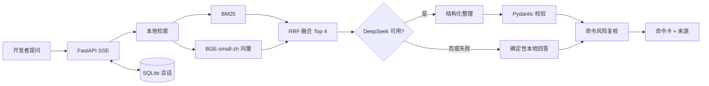

# 架构与关键取舍

## 核心链路



## 目录职责

```text
backend/app/
  knowledge.py    加载 topics.json 与 manifest 追溯校验
  retrieval.py    分词、BM25、FastEmbed、内存余弦、RRF
  generation.py   DeepSeek OpenAI-compatible 调用与 JSON 校验
  answering.py    模型/本地回答路由与引用装配
  risk.py         与模型无关的确定性风险规则
  repository.py   单用户 SQLite 会话仓储
  main.py         精简 API 与 SSE 事件契约
frontend/src/     单页问答工作台
desktop/electron/ 进程、协议、窗口和 safeStorage 边界
knowledge/        100 个结构化主题、manifest、评测集和声明
```

## 为什么这样设计

### 小数据直接内存检索

知识库只有 100 个主题。引入 Milvus、FAISS、Chroma 或 PostgreSQL 会增加部署、调试和讲解成本，却不会带来可见收益。所有主题向量在启动时归一化并驻留内存，查询只需一次矩阵乘法。

### BM25 与向量互补

命令问题常含精确 token，例如 `git revert`、`CREATE VIEW`；BM25 对这类词稳定。中文口语改写更适合语义向量。两路结果用 RRF 按排名融合，避免比较不同分数空间。

### LLM 不是单点故障

DeepSeek 只重组本地命中，不能决定来源，也不能绕过风险规则。无 Key、超时、429、非法 JSON 或模型不可用时，命令仍从同一知识主题确定性生成。

### 桌面安全边界

Renderer 只得到 API 地址、版本号以及四个模型配置方法。密钥由主进程用 DPAPI 加解密，并仅通过后端子进程环境变量注入；Renderer 无“读取密钥”能力。

## API 契约

`POST /chat/stream` 依次发送 `status`、`answer`、`done`，异常使用 `error`。回答对象固定包含 `mode`、`summary`、`commands`、`notes` 和 `citations`。会话 API 只保留创建、列表、读取、删除；`GET /knowledge/status` 只读。
