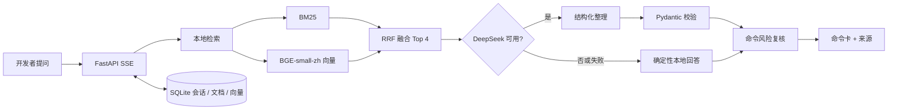

# 架构与关键取舍

## 核心链路



## 目录职责

```text
backend/app/
  knowledge.py    加载 topics.json 与 manifest 追溯校验
  retrieval.py    分词、BM25、FastEmbed、内存余弦、RRF
  generation.py   DeepSeek OpenAI-compatible 调用与 JSON 校验
  answering.py    模型/本地回答路由与引用装配
  risk.py         与模型无关的确定性风险规则
  extraction.py   TXT / Markdown / PDF / DOCX 文本提取
  text.py         标题、段落和代码围栏感知切分
  documents.py    上传文件与可恢复后台索引队列
  repository.py   SQLite 会话、知识库、文档与分块仓储
  main.py         多知识库 API 与 SSE 事件契约
frontend/src/     问答工作台与知识库管理页
desktop/electron/ 进程、协议、窗口和 safeStorage 边界
knowledge/        300 个结构化主题、来源锁、评测集和声明
```

## 为什么这样设计

### 小数据直接内存检索

内置知识库只有 300 个主题，自定义库也定位于个人文档规模。引入 Milvus、FAISS、Chroma 或 PostgreSQL 会增加部署和打包成本。每个知识库按需加载 BM25 与归一化向量矩阵，文档变更后原子替换缓存。

### BM25 与向量互补

命令问题常含精确 token，例如 `git revert`、`CREATE VIEW`；BM25 对这类词稳定。中文口语改写更适合语义向量。两路结果用 RRF 按排名融合，避免比较不同分数空间。

### LLM 不是单点故障

DeepSeek 只重组本地命中，不能决定来源，也不能绕过风险规则。无 Key、超时、429、非法 JSON 或模型不可用时，命令仍从同一知识主题确定性生成。

### 桌面安全边界

Renderer 只得到 API 地址、版本号以及四个模型配置方法。密钥由主进程用 DPAPI 加解密，并仅通过后端子进程环境变量注入；Renderer 无“读取密钥”能力。上传文件只进入本机 FastAPI 和用户数据目录。

## API 契约

`POST /chat/stream` 依次发送 `status`、`answer`、`done`，异常使用 `error`。回答对象包含 `mode`、`summary`、`commands`、`notes`、`citations` 和 `generation`。对话固定绑定知识库，传入不一致的 `knowledge_base_id` 返回 409。知识库与文档接口支持 CRUD、上传、预览和重建索引。
